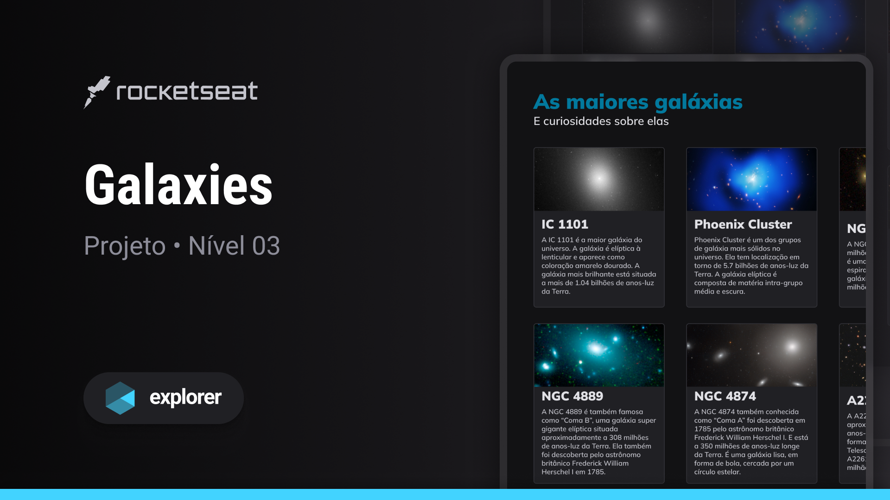

  

## 🖥️ Projeto

Esse projeto de página com listagem de galáxias é desenvolvido no nível 03 do Explorer.

## 🚀 Tecnologias

Esse projeto foi desenvolvido durante a Nivel 03 do Explorer da Rocketseat com as seguintes tecnologias:

- HTML
- CSS
- Figma
- Git e Github

## 🏷️ Layout

Você pode visulizar o layout do projeto através
[desse link](<https://www.figma.com/community/file/1256354736253234634>).
É necessario ter uma conta no [Figma](https://www.figma.com)
